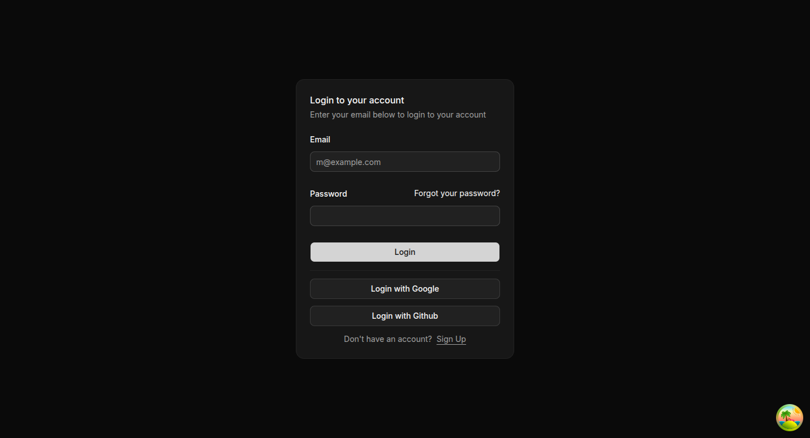
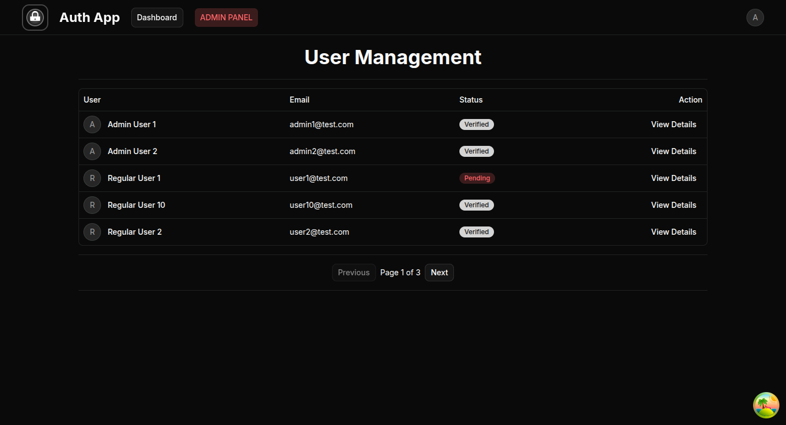

# Securify: Full-Stack Secure Authentication System

  
*Placeholder for banner – replace with login/dashboard collage or architecture diagram.*

**Securify** is a secure, production-ready full-stack authentication system built as a learning/template project. It features stateless JWT with HttpOnly refresh cookies, multi-provider OAuth2 (Google & GitHub), email verification, password reset, RBAC, and admin tools.

This monorepo contains:
- **Backend**: Java 25 + Spring Boot (secure API)
- **Frontend**: React 19 + TypeScript + Vite (modern client)

Detailed documentation is inside each folder (`backend/README.md` and `frontend/README.md`).

> **Author**: Anish Raj  
> **Last Updated**: January 2026  
> **License**: MIT

---

## Quick Overview

- Stateless dual-token auth (access in memory, refresh in HttpOnly cookie)
- Local + social login
- Silent refresh & session persistence
- Role-based access (USER / ADMIN)
- Admin user management with pagination
- Secure by default (JTI rotation, no localStorage, generic errors)

---

## Monorepo Structure

    securify/
    ├── backend/          # Spring Boot API (detailed README inside)
    │   ├── src/
    │   └── pom.xml
    ├── frontend/         # React + Vite app (detailed README inside)
    │   ├── src/
    │   └── package.json
    ├── .gitignore
    └── README.md         # This file (high-level overview)

---

## Tech Stack

### Backend
- Java 25 + Spring Boot 3.4+
- Spring Security + JWT (jjwt)
- PostgreSQL + JPA
- Spring Mail (Mailtrap sandbox)

### Frontend
- React 19 + TypeScript
- Vite + React Router v7
- Tailwind CSS + Shadcn/UI
- Zustand + React Query
- Axios + React Hook Form + Zod

---

## Quick Setup & Run

### Prerequisites
- Java 25 JDK
- Maven
- Node.js v20+ + pnpm
- PostgreSQL
- Mailtrap account

### 1. Environment
- Backend: Configure `.env` or `application.properties` (see backend/README.md)
- Frontend: Create `frontend/.env` with `VITE_API_URL=http://localhost:8080/api`

### 2. Database
    CREATE DATABASE authdb;

### 3. Run Backend
    cd backend
    ./mvnw spring-boot:run
    # API: http://localhost:8080/api

### 4. Run Frontend
    cd frontend
    pnpm install
    pnpm dev
    # App: http://localhost:3000

### Concurrent (optional)
    npm i -g concurrently
    concurrently "cd backend && ./mvnw spring-boot:run" "cd frontend && pnpm dev"

Test accounts are auto-seeded on backend startup.

---

## Screenshots 

  
  

---

## More Details
See individual folder READMEs for:
- Full API docs & security deep-dive (backend)
- Component architecture & hooks (frontend)
- Troubleshooting & enhancements

---

Thank you for using Securify! 🚀
